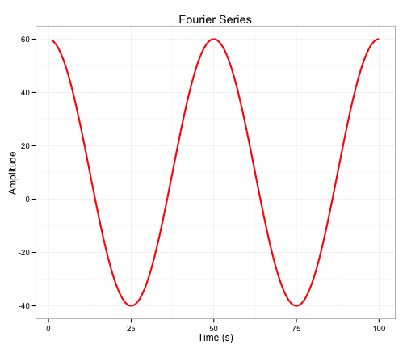

## Simulating time series

This shiny app provides an interactive interface to 
genenerate Fourier series by varying the key input parameters
 

--- .class #id 

## Formula
The simple Fourier series is defined as 

$$f(x)= A_0 + A_1 cos(2\pi * t / p + \phi)  $$

where 
* $A_0$ is the mean magnitude of the signal
* $A_1$ is the amplitude of the oscillation
* $p$ is the period of oscillation 
* $\phi$ is the phase of the oscillation at origin

--- .class #formula

## Example plot of a Fourier series 
The following shows a sample plot with parameters
$A_0$ = 10,  $A_1$=5, $p$ = 50 and $\phi$=0

--- .class #plot

## Conclusion

Hopefully this simple shiny application will be useful to others. 

